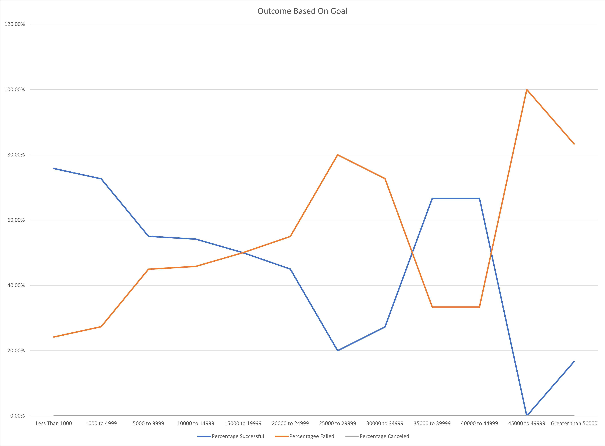

# Kickstarter Challenge - Evaluating campaigns funding progress in relation to their launch dates

## Overview of Project
This project is a review of how well theater Kickstarter campaigns did in relation to their respective Kickstarter launch dates.  This report will contain an analysis along with visuals.

### Purpose
Louise’s Kickstarter fundraiser raised a respectable some of money in a short amount of time. Nearly reaching her goal to fund the play 'Fever'.  The purpose of this analysis is to see how well other theater Kickstarters faired in relation to their start dates.  Louise will be able to use this analysis and visualizations to understand how her fundraising efforts compared to others.  This will allow for an assessment of "lessons learned" to help improve upon future fundraising campaigns.

## Analysis and Challenges
Modifying the original Kickstarter file, I added columns to convert kickstart data in the date column in a readable format to better understand date kickstarters were launched and when they ended. After the creation of those columns, I created another column that extracted the year out of the date started columns.  This will assist in the filtering of the data on a monthly basis in a year over year format.  
*This data will allow me to evaluate when is typically the best and worst time to start a kickstarter. 
*This data will allow Louise to compare her results in relation to others and decide if any future action is necessary.

From there, I created another tab in the workbook to allow me to break the data down further.  I created a goal column with incrementing goal ranges.  Then I compared the number of successful, failed, and kickstarters in relation to those ranges.  This allowed me to do the following:
*Allowed me to review the data in order to see if there is a goal range that proved to be more successful than others.  
*This will allow Louise to see how her set goal compared to others and will allow her to make any potential adjustments in the future.

### Analysis of Outcomes Based on Launch Date
Based on the launch date one can determine the months that are more inclined to having success and the months were success is less likely.  The observation of the Outcomes Based on Launch Date data set is the following:
*May appears to be the most active month to start kickstarters, with 166 starting, and the month were more kickstarters are successful, with 111 successful campaigns.  Although not as good as May, June and July also appear to be active months for kickstarters and the data shows higher success rates during these months as well.
*The data shows the month of December as the least active month to start kickstarters for theaters, with 75 initiated and has the fewest successful kickstarters started, with only 37.
*The quantity of failed campaigns seems to be relatively consistent month over month without the large undulations as is seen in the successful kickstarter data.

### Analysis of Outcomes Based on Goals
The Analysis of Outcomes Based on Goals chart is interesting to evaluate.  Except for a couple of data points in the goal range of $35,000 to $45,000 range, both failed and successful percentages tend to follow a straight line fit in opposite direction.  There appears to be a direct connection between the goal amount and whether a project is successful or fails.  Examples are as follows:
*At the lower ranges, the percentage of success is higher, and the failure rate is lower (75% vs 25% respectively).  
*As the goal ranges increase in dollar amounts the success rates fall, and the failure rates increase (17% vs 83% respectively).  
*There appears to be a cross over point where success and failure rates are at 50% before diverging in opposite directions.  The range where the goal shows 50/50      failure/success rate is between $15000 and $20000. 

### Challenges and Difficulties Encountered
Challenges in relationship to the manipulation of the kickstarter dataset was minimum.  Although I was able to apply formulas and lay out the tables appropriately, I couldn’t help but feel there was a better way to modify headrs and such without manually making the change one by one.  For the sake of time, I decided to push through with one-by-one manual modifications of the formulas until I can learn shortcuts later. 

## Results

- What are two conclusions you can draw about the Outcomes based on Launch Date?
Conclusion number one is the month of May appears to be the best month to start a kickstarter campaign and have a successful campaign.  While June and July appear to be the next best option for both starting and having a successful kickstarter.  
The second conclusion is the month of December appears to have the least activity with regards to starting a kickstarter and the lowest success rate.

- What can you conclude about the Outcomes based on Goals?
Based on the Outcomes Based on Goals analysis, one can conclude that there is a a direct connection between the goal amount and whether fund raising campaign is successful or fails.  Goals set too high may not be reached and goals set too low may be insufficient to fund a project.  One must fully understand what is required to fund their projects and must set a number that is appropriate to reach their funding goals. 

- What are some limitations of this dataset?
The dataset as provided in this exercise fails to link the success and failure rates based on the launch month of the kick starter in relation to the goal amount for that kickstarter.  It would be interesting to see if the goals set for the month of May were more in line with a goal level set that have shown higher levels of success as highlighted in the Outcome vs Goals chart. 
Another issue with the dataset provided, is it does not consider any macro or micro economic factors that my impact the success or failure rate of any given kickstarter campaign.  Macro factors such as recessions or micro factors such as less discretionary spending during the holidays than compared to the summer months.

- What are some other possible tables and/or graphs that we could create?
In addition to a table that cross references the range of goals for successful and failed kickstarters in the month of May, a table that shows year over year performances of kickstarters of multiple industries.  This information would prove to be valuable as it could show if certain industries are falling out of favor.  Are kickstarters associated with publishing falling out of favor when compared to technology kickstarters?  How do food kickstarter campaigns success/fail rates over multiple years trend in comparison to theater kickstarters.  This would be helpful to see this historical analysis so if Louise were to decide to have another fundraising campaign in the future, she would be more confident in its likelihood for success.
Another interesting view would be how quickly did the successful kickstart campaign reached their goals.  How many days did it take for successful campaigns to reach their goals in relation to their start dates?  This could be helpful for Louise to set not only a reasonable goal, at the correct time of year, but also to provide it enough time.
